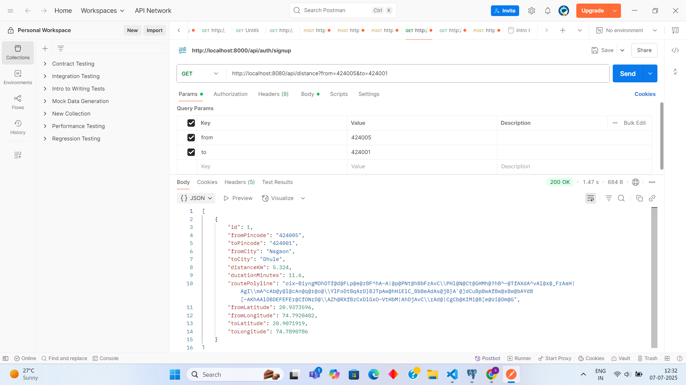
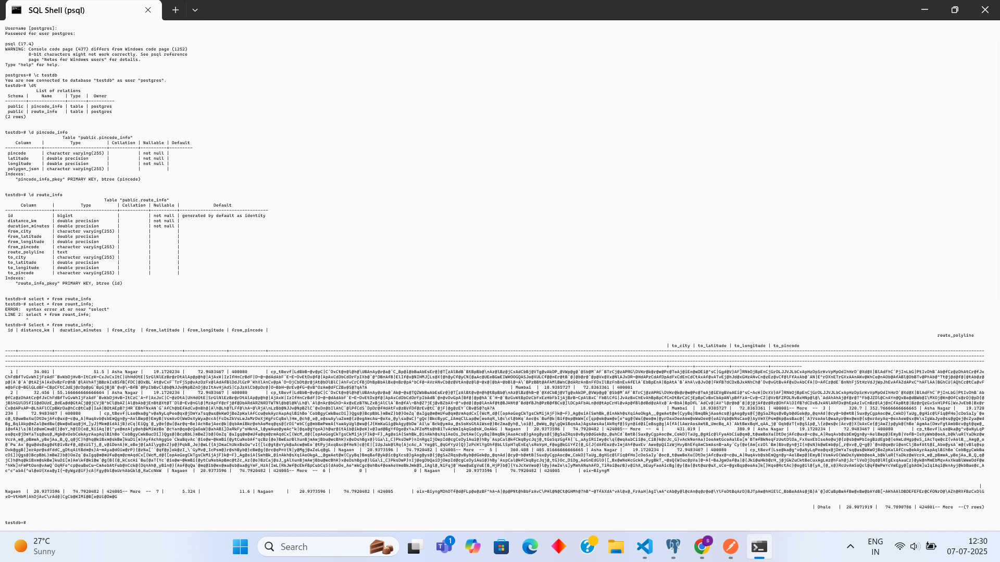

```
Overview:
---------
This API calculates the distance and duration between two Indian pincodes using the Google Maps API.
It caches results in a PostgreSQL database and returns the data in a REST-compliant format.
The application stores latitude and longitude for the pincodes, and also the route polyline.

Database:
---------
- PostgreSQL is used as the RDBMS.
- Tables:
  1. distance_info
     - id (PK)
     - from_pincode
     - to_pincode
     - from_city
     - to_city
     - distance_km
     - duration_minutes
     - route_polylinehttp://localhost:8080/api/distance?from=411014&to=400001
     - from_latitude
     - from_longitude
     - to_latitude
     - to_longitude

API Endpoint:
-------------
GET http://localhost:8080/api/distance?from=411014&to=400001

Response:
---------
Returns a JSON array with route, distance and location data.

Sample Response:
----------------
[
    {
        "id": 5,
        "fromPincode": "411014",
        "toPincode": "400001",
        "fromCity": "Pune",
        "toCity": "Mumbai",
        "distanceKm": 160.617,
        "durationMinutes": 183.1,
        "routePolyline": "<encoded-polyline>",
        "fromLatitude": 18.5573967,
        "fromLongitude": 73.9281728,
        "toLatitude": 18.9385727,
        "toLongitude": 72.8363361
    }
]

Key Features:
-------------
- Google Maps API Integration (for directions, distance, duration)
- PostgreSQL for persistent storage
- Cache mechanism avoids repeated API calls for same routes
- Latitude and Longitude stored for both pincodes
- Route polyline included for map drawing

Testing:
--------
- REST-compliant (testable via Postman or curl)
- TDD preferred (JUnit for backend)

Instructions:
-------------
1. Setup PostgreSQL and update application.properties
   google.maps.api.key=API_KEY
   spring.datasource.username=postgres
   spring.datasource.password=Shreyash1@#

2. Run the Spring Boot application.
3. Access: http://localhost:8080/api/distance?from=411014&to=400001

Author: Shreyash Chandwadkar
GitHub: https://github.com/shreyash1231/Pincode-Distance-Finder
